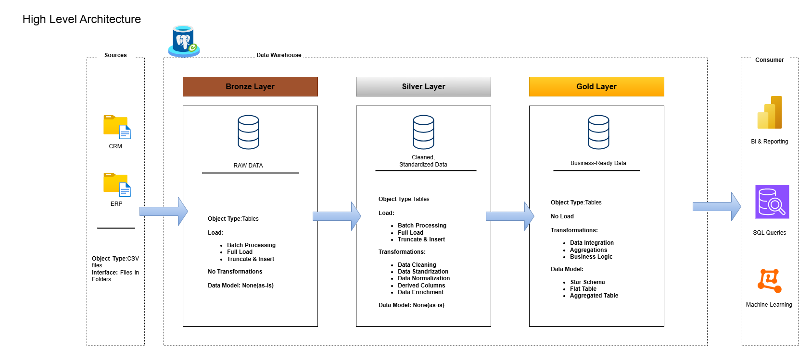

# Data-warehouse-project

Welcome to the **Data warehouse project** repository!
This project demonstrates a comprehensive data warehousing and analytics solution, from building a data warehouse to generating actionable insights.
---
## Data Architecture
The data architecture for this project follows Medallion Architecture **Bronze**, **Silver**, and **Gold** layers:

1. **Bronze Layer**: Stores raw data as-is from the source systems.
2. **Silver Layer**: This layer includes data cleansing, standardization, and normaization processes to prepare data for analysis.
3. **Gold Layer**: Houses business-ready data modeled into a star schema required for reporting and analytics.

---
## Project Overview:

This project involves:
1. **Data Architecture**: Designing a modern data warehouse using Medallion Architecture.
2. **ETL pipelines**: Extracting, transforming, and loading data from source systems into the warehouse.
3. **Data Modeling**: Developing fact and dimension tables optimized for analytical queries.
4. **Analytics & Reporting**: Creating SQL-based reports and dashboards for actionable insights.

## Project Requirements

### Building the Data Warehouse

####Objective
Develop a modern data warehouse using Postgresql to consolidate sales data, embling analytical reporting and informed decision-making.

#### Specifications
- **Data Sources**: Import data from two source systems (ERP and CRM) provided as CSV files.
- **Data Quality**: Cleanse and resolve data quality issues prior to analysis.
- **Integration**: Combine both sources into a single, user-friendly data model designed for analytical queries.
- **Scope**: Focus on the latest dataset only;
- **Documentation**: Provide clear documentation of the data model to support both business stakeholders and analytics teams.

---
## License
This project is licensed under the [MIT License](LICENSE). You are free to use, modify, and share this project with proper attribution.

## About Me
Hi there! I'm **Rahul Kotiyan**. I'm a aspiring Data Analyst.
